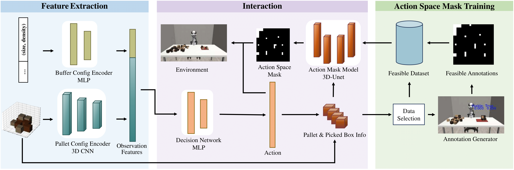
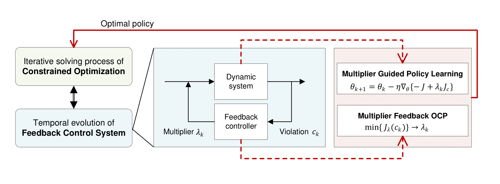

I'm Tianqi Zhang, an underguaduate student from Tsinghua University, majoring in Mathematics and Physics & Measurement Control Technology and Instruments. 
During my studies at Tsinghua University, I have interned in [iDLAB](http://www.idlab-tsinghua.com/thulab/labweb/index.html) led by [Shengbo Li](https://www.svm.tsinghua.edu.cn/essay/80/1812.html).
I was very fortunate to have the opportunity to go to UC Berkeley for summer research at the end of my junior year, where I was advised by [Masayoshi Tomizuka](https://me.berkeley.edu/people/masayoshi-tomizuka/) and worked closely with [Mingyu Ding](https://dingmyu.github.io/) and [Wei Zhan](https://zhanwei.site/).

Here is my research interests:
+ **Robot learning**: Using a robotic arm as the platform, I aim to make robots more practical by developing more robust and secure algorithms.
+ **Computer vision**: I'm interested in leveraging diffusion models for dense prediction tasks, such as depth estimation, and dense point tracking.

Feel free to contact me via email zhang-tq21@mails.tsinghua.edu.cn !

## Research Publications

  
  

    <strong>Physics-Aware Robotic Palletization with Online Masking Inference</strong> 
    
      <strong>Tianqi Zhang</strong>, Zheng Wu, Yuxin Chen, Yixiao Wang, Boyuan Liang, Scott Moura, Masayoshi Tomizuka, Mingyu Ding, Wei Zhan
    
    
      ICRA 2025
    
    <a href="https://arxiv.org/abs/2502.13443" target="_blank" style="text-decoration: none; color: #0366d6; font-size: 14px;">[arXiv]</a> |
    <a href="https://github.com/tianqi-zh/palletization" target="_blank" style="text-decoration: none; color: #0366d6; font-size: 14px;">[GitHub]</a>
  

  
  

    <strong>Predictive Lagrangian Optimization for Constrained Reinforcement Learning</strong> 
    <strong>Tianqi Zhang</strong>, Puzhen Yuan, Guojian Zhan, Ziyu Lin, Yao Lyu, Zhenzhi Qin, Jingliang Duan, Liping Zhang, Shengbo Eben Li 
    <a href="https://arxiv.org/abs/2501.15217" target="_blank" style="text-decoration: none; color: #0366d6; font-size: 14px;">[arXiv]</a>
  

